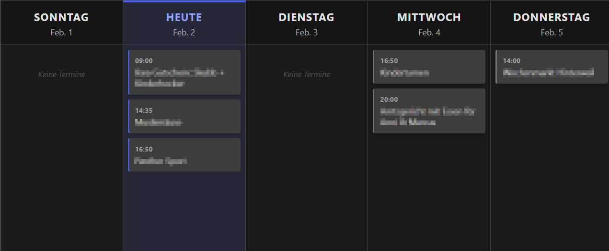

# Vibe Wall Calendar


<!-- Place your screenshot at docs/screenshot.png or update the link above -->

A lightweight, self-hosted wall calendar specifically designed for older hardware (e.g., Android 4.4 tablets running Firefox 64). It fetches events from an Apple iCloud calendar and displays them in a clear, 5-day rolling view (Yesterday → Day after Tomorrow).

## Features

*   **5-Day Rolling View**: Always shows Yesterday, Today, and the next 3 days.
*   **Lightweight SSR**: Server-Side Rendered HTML/CSS. Minimal JavaScript. ideal for legacy browsers (Firefox 64+, Android KitKat).
*   **Theming**: Automatically switches between Light and Dark mode based on sunrise/sunset, or force a specific theme.
*   **Multi-Calendar Support**: Fetch events from multiple calendars and assign custom colors/tints to each.
*   **iCloud Integration**: Connects seamlessly via CalDAV.
*   **Multi-language**: Supports English (`en`) and German (`de`).
*   **Details Overlay**: Click on events to see details (location, description, time range).
*   **All-Day Support**: Handles multi-day events with visual stacking and continuation arrows.

---

## 🚀 Quick Start

### Option 1: Run with Docker (CLI)

The easiest way to run the application is using the pre-built image from the GitHub Container Registry.

```bash
docker run -d \
  --name vibe-wallcalendar \
  --restart unless-stopped \
  -p 5000:5000 \
  -e ICLOUD_USERNAME="your_email@example.com" \
  -e ICLOUD_PASSWORD="your_app_specific_password" \
  -e TIMEZONE="Europe/Berlin" \
  ghcr.io/sonntam/vibe-wallcalendar:latest
```

Open your browser to `http://localhost:5000`.

### Option 2: Run with Docker Compose

For a more permanent setup, use `docker-compose`.

1.  Create a `docker-compose.yml` file:

```yaml
version: '3.8'
services:
  wallcalendar:
    image: ghcr.io/sonntam/vibe-wallcalendar:latest
    container_name: vibe-wallcalendar
    restart: unless-stopped
    ports:
      - "5000:5000"
    environment:
      - ICLOUD_USERNAME=your_email@example.com
      - ICLOUD_PASSWORD=your_app_specific_password
      - ICLOUD_URL=https://caldav.icloud.com/
      - CALENDARS="Family:#3d5afe, Work:#ff9800, Sports"
      - TIMEZONE=Europe/Berlin
      - DAYS_TO_SHOW=5
      - LANGUAGE=en
      # Optional: Coordinates for Auto-Dark/Light Theme
      - LATITUDE=52.5200
      - LONGITUDE=13.4050
```

2.  Start the container:
    ```bash
    docker-compose up -d
    ```

### Option 3: Run from Remote Source (No Clone)

Build and run the latest code directly from GitHub without manually cloning the repository.

1.  Create a `docker-compose.yml` file:

```yaml
version: '3.8'
services:
  wallcalendar:
    # Build directly from the main branch of the repository
    # The #:app suffix tells Docker to use the 'app' subdirectory as the build context
    build: https://github.com/sonntam/vibe-wallcalendar.git#:app
    container_name: vibe-wallcalendar
    restart: unless-stopped
    ports:
      - "5000:5000"
    environment:
      - ICLOUD_USERNAME=your_email@example.com
      - ICLOUD_PASSWORD=your_app_specific_password
      - ICLOUD_URL=https://caldav.icloud.com/
      - CALENDARS="Family:#3d5afe, Work:#ff9800, Sports"
      - TIMEZONE=Europe/Berlin
      - DAYS_TO_SHOW=5
      - LANGUAGE=en
```

2.  Run:
    ```bash
    docker-compose up -d --build
    ```

### Option 4: Run from Source (Manual Clone)

If you want to modify the code or run specific unreleased changes:

1.  Clone the repository:
    ```bash
    git clone https://github.com/sonntam/vibe-wallcalendar.git
    cd vibe-wallcalendar
    ```

2.  Create a `secrets.env` file for your credentials (optional, but recommended):
    ```bash
    ICLOUD_USERNAME=your_email@example.com
    ICLOUD_PASSWORD=your_app_specific_password
    ```

3.  Build and run using the provided `docker-compose.yml`:
    ```bash
    docker-compose up -d --build
    ```

---

## ⚙️ Configuration

The application is configured entirely via Environment Variables.

| Variable | Required | Default | Description |
| :--- | :---: | :--- | :--- |
| `ICLOUD_USERNAME` | ✅ | - | Your Apple ID email address. |
| `ICLOUD_PASSWORD` | ✅ | - | An **App-Specific Password** (Generate at [appleid.apple.com](https://appleid.apple.com)). |
| `ICLOUD_URL` | ❌ | `https://caldav.icloud.com/` | The CalDAV server URL. |
| `CALENDARS` | ❌ | - | List of calendars to fetch with optional colors. Format: `"Name:Color, Name2"`. |
| `CALENDAR_NAME` | ❌ | (First found) | **Legacy**: The display name of a single calendar to fetch. Used if `CALENDARS` is unset. |
| `TIMEZONE` | ❌ | `Europe/Berlin` | The timezone for the calendar view (e.g., `America/New_York`). |
| `DAYS_TO_SHOW` | ❌ | `5` | Number of columns/days to display in the view. |
| `LANGUAGE` | ❌ | `en` | Interface language (`en` or `de`). |
| `THEME` | ❌ | `auto` | Force theme: `light`, `dark`, or `auto`. |
| `LATITUDE` | ❌ | - | Decimal latitude for calculating sunrise/sunset (Auto-Theme). |
| `LONGITUDE` | ❌ | - | Decimal longitude for calculating sunrise/sunset (Auto-Theme). |

### Note on Theming
By default (`THEME=auto`), the application uses **Auto-Theme** logic:
*   If `LATITUDE` and `LONGITUDE` are provided, it switches to **Light Mode** during daylight hours (Sunrise + 45min to Sunset - 30min).
*   If coordinates are missing, it defaults to **Dark Mode**.

You can force a specific mode by setting `THEME=light` or `THEME=dark`.

---

## 🛠 Development

### Architecture
*   **Backend**: Python 3.11 + Flask + CalDAV.
*   **Frontend**: Jinja2 Templates + CSS3 (Flexbox/Grid). No build steps required.

### Releasing
This project uses **Conventional Commits** via Release Please.
*   `feat: ...` -> Minor version.
*   `fix: ...` -> Patch version.
*   `feat!: ...` -> Major version.

Pushing to `main` triggers a Release PR. Merging that PR publishes a new Docker image to GHCR.
